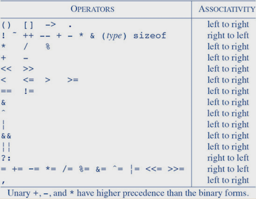

# Operators

Operators are symbols which operate on given values, producing a new one.

### Arithmetics

There are five arithmetic operators: `+`, `-`, `*`, `/` and `%`.

* *integer* division throws away the fractional part
* `%` cannot be applied to `float` or `double`
* truncation direction of `/` and sign of `%` are machine-dependent

They are **left-associative**. Precedence is in this order, from *highest* to *lowest*:

* unary `+` and `-`
* `*`, `/` and `%`
* binary `+` and `-`

### Logic

Pretty standard stuff: `<`, `>`, `>=`, `<=`, `!=`, `==`, `!`, `&&` and `||`.

Precedence *high* to *low*:

* `!`
* `<`, `>`, `>=` and `<=`
* `!=` and `==`
* `&&`
* `||`

Unary `!`, negation, turns 0 to 1, and non-0 to 0. It has higher precedence than all *binary* operators, but lower than unary `+` and `-`.

Logical operators `&&` and `||` are **left-associative**, and are **lazy-evaluated**, allowing for a code like:

```c
int readlim(char s[], int lim) {
    int i = 0;
    while (i < lim - 1 && (s[i] = getchar()) != EOF) {
        i++;
    }
    return i;
}
```

> If it wasn't for lazy evaluation, `i < lim - 1 && (s[i] = getchar()) != EOF` would result in an unexpected behavior. `i < lim - 1` makes sure the whole expression ends before we try to assign something to `s[lim]`.

### Increment & decrement

Increment is `++`, decrement `--`. Both alter the value by 1. They can be *prefix* or *suffix*. The value of the expression:

* **prefix** as *after* the change
* **suffix** as *before* the change

```c
int i = 0;
printf("%d\n", ++i);  // 1
printf("%d\n", i++);  // 1
printf("%d\n", i);    // 2
printf("%d\n", --i);  // 1
printf("%d\n", i--);  // 1
printf("%d\n", i);    // 0
```

These operators can only be applied to *variables*. Something like `(1 + 2)++` is illegal.

### Bitwise

These manipulate **bits** of any given *integer* values:

* `&` - AND
* `|` - OR
* `^` - XOR
* `~` - NOT
* `<<` - shift left by *n*
* `>>` - shift right by *n*

> **Note:** Right-shifting fills `unsigned` quantity always with 0s, `signed` depends on the machine - either with 0-bits (logical shift), or sign bits (arithmetic-shift).

### Assignment

All binary *arithmetic* and *logical* operators (except `~`) have a corresponding **assignment** operator with the form `<expr1> <op>= <expr2>;`:

```c
int n = 1;
n += 100;  // 101
```

Expression on the *right* is always fully evaluated before the assignment is executed:

```c
int x = 3;
int y = 5;
x = x * (y + 2);  // 21
x *= y + 2;       // 21
```

### Ternary

Known as the *conditional expression*. Syntax is `<condition> ? <expr-1> : <expr-0>` as usual. If `expr-1` and `expr-2` are of different types, *type conversion* rules from [#2](./02types.md) apply, no matter what the result of the condition is:

```c
int n = 5;
n > 5 ? 5.5 : 10;   // double
n < 5 ? 13.37f : 5; // float
n == 5 ? 10 : 300l; // long
```

### Comma

The binary operator `,` makes sure the expressions are evaluated *left* to *right*, and is used mostly in `for` statements to adjust more values:

```c
int len = 5;
int i, j;  // NOT the ',' operator
for (i = 0, j = len - 1; i < len; i++, j--)
    // 'i' goes from the start
    // 'j' goes from the end
```

The *type* and the *value* are those of the *right* operand, `j--` in this case.

> **Note:** Careful! The `,` operator is **not** the same as the function argument or variable declaration separator!

### Precedence

Refer to this table:



Operand execution order is **not** guaranteed! The only exceptions being `&&`, `||`, `?:` and `,`. Thus in:

```c
printf("%d\n", ++n, power(2, n)); // WRONG!
a[i] = i++;                       // WRONG!
```

There's not defined whether `n` is incremented first, or `power(2, n)` is executed first. Don't do that! Store the result of `++n` in a variable:

> **Note:** *Function calls*, nested *assignments*, *increment* and *decrement* cause **side effects** - variables can be changed with the evaluation of the expressions. It is intentionally not specified in which order shall the side effects happen.

```c
int nplus = ++n;
printf("%d\n", nplus, power(2, nplus)); // OK
int iorig = i;
a[iorig] = ++i;                         // OK
```
